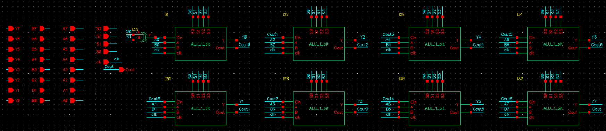
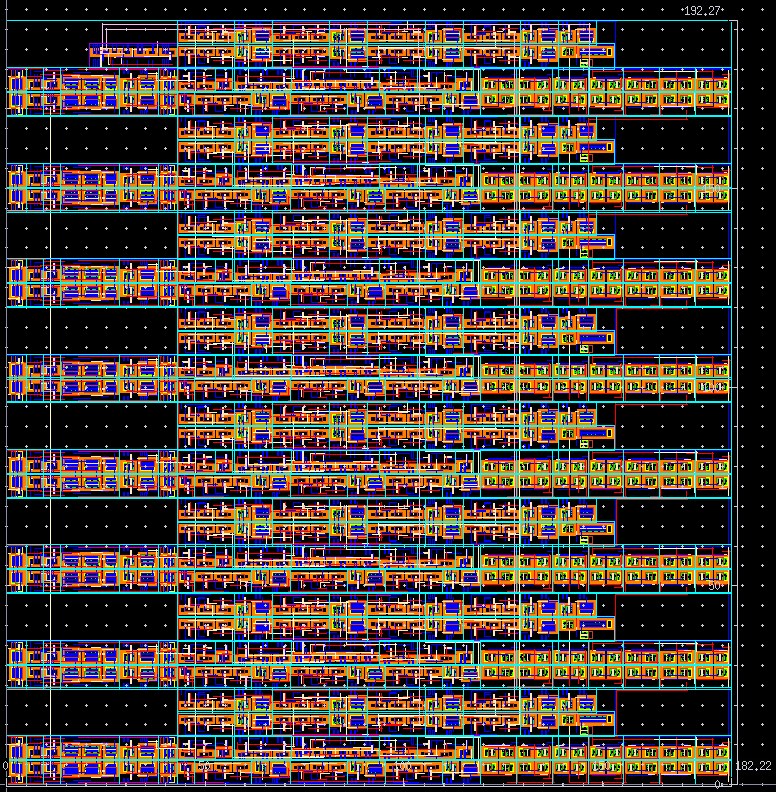

# 8-bit ALU (VLSI / Transistor-Level Design)

Introduction to VLSI course final project — Braude College of Engineering.

**Authors:** Nofar Tapiero & Nastia Vergun
**Tools:** Cadence Virtuoso (schematic + layout, transistor-level design)

## Overview

Full-custom transistor-level design of an 8-bit ALU supporting 10 arithmetic and bit-wise logical operations, built up from 1-bit slices. Input data is latched on the rising clock edge; outputs are generated after propagation delay through the combinational logic.

**Design flow:** logic gates → multiplexers (2:1 → 4:1 → 8:1) → logic unit, full adder → arithmetic unit, latch + tri-state buffers → 1-bit ALU slice → 8-bit ALU, each stage designed at the schematic level, laid out, and verified by simulation.

## Operation Codes

| S3 S2 S1 S0 | Output | Unit |
|---|---|---|
| 0 0 0 0 | A + B | Arithmetic |
| 0 0 0 1 | A − B | Arithmetic |
| 0 0 1 0 | A + 1 | Arithmetic |
| 0 0 1 1 | A − 1 | Arithmetic |
| 1 0 0 0 | NOT A | Logic |
| 1 0 0 1 | A NOR B | Logic |
| 1 0 1 0 | A NAND B | Logic |
| 1 0 1 1 | A AND B | Logic |
| 1 1 0 0 | A OR B | Logic |
| 1 1 0 1 | A XOR B | Logic |

## Top-Level Schematic



## Layout



**Physical area:** 192.27 µm × 182.22 µm ≈ 35,041 µm²
**Transistor count:** 1,980 transistors (≈ 17.7 µm² per transistor)

## Design Challenges

- **Full-adder timing:** initial rise/fall time (439 ps) exceeded the 100–150 ps target — resolved by re-balancing the PMOS/NMOS sizing ratio.
- **Logic-unit signal integrity:** slow rise time at the logic unit output degraded downstream timing — resolved by adding a buffer stage between the 2:1 MUX and the 8:1 MUX.
- **Latch propagation delay:** the input latch delayed data availability to the ALU — resolved by upsizing transistors in the latch feedback path.

## Repository Structure

```
report/       Full project report (schematics, layouts, and simulation results per module)
alu_top_schematic.png   8-bit ALU top-level schematic
alu_layout.png          8-bit ALU physical layout
```
